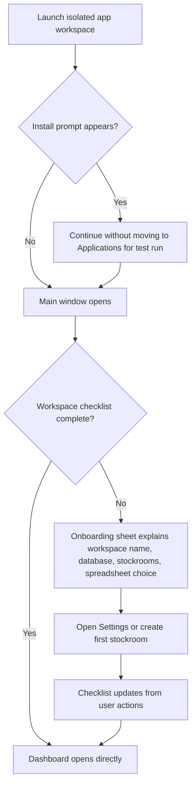
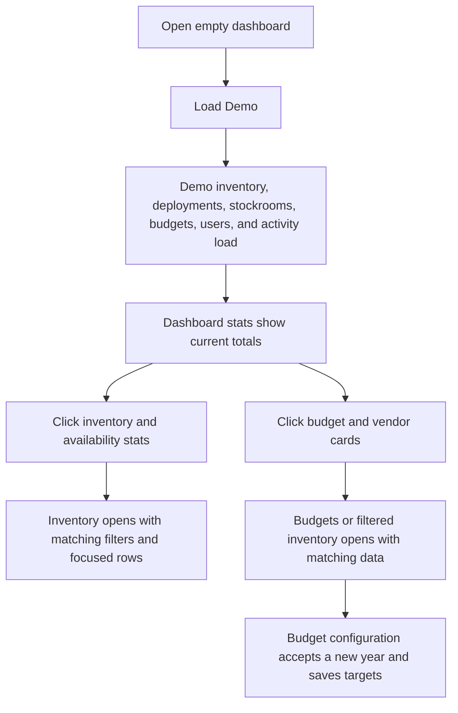
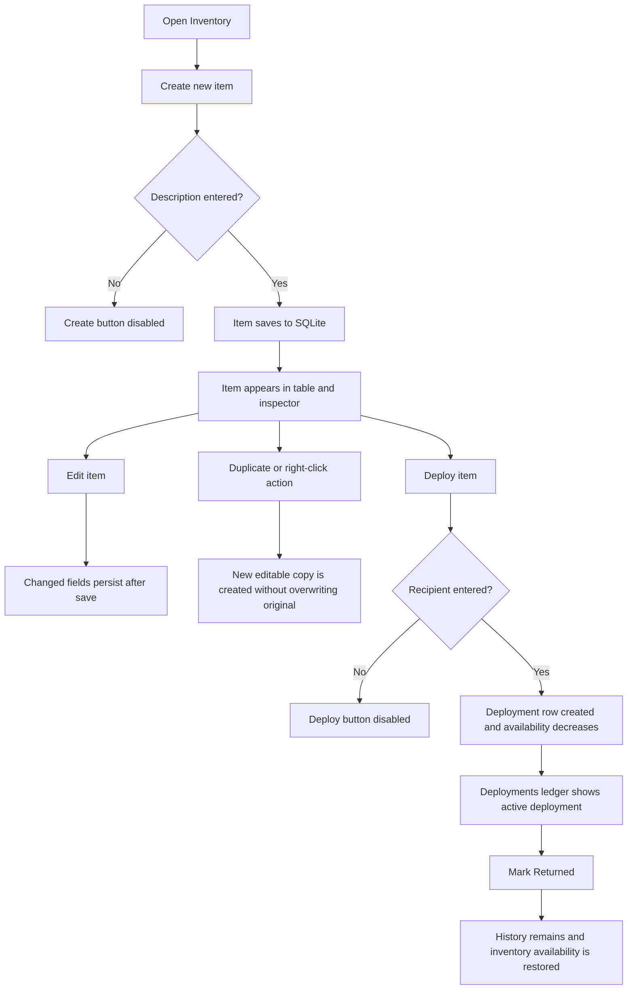
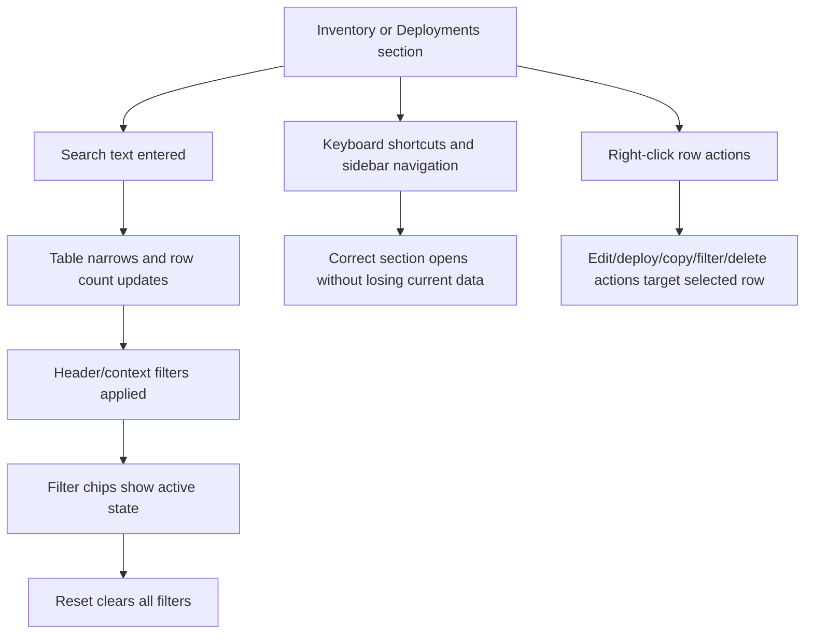
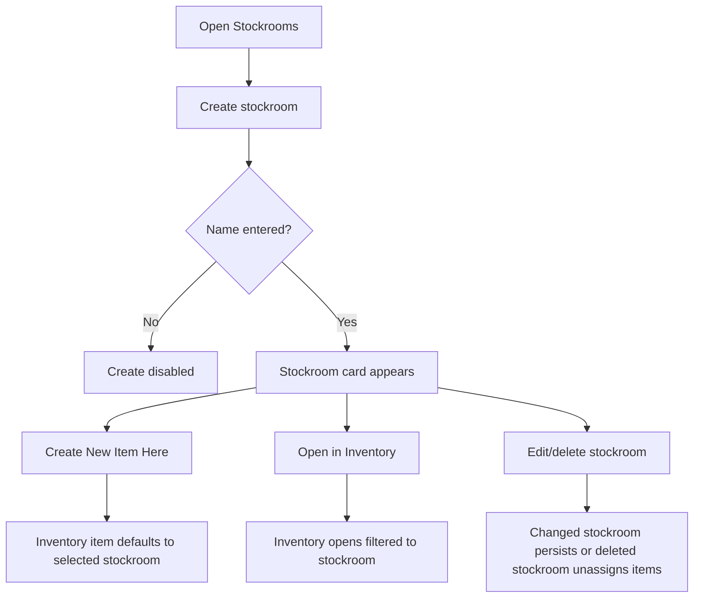
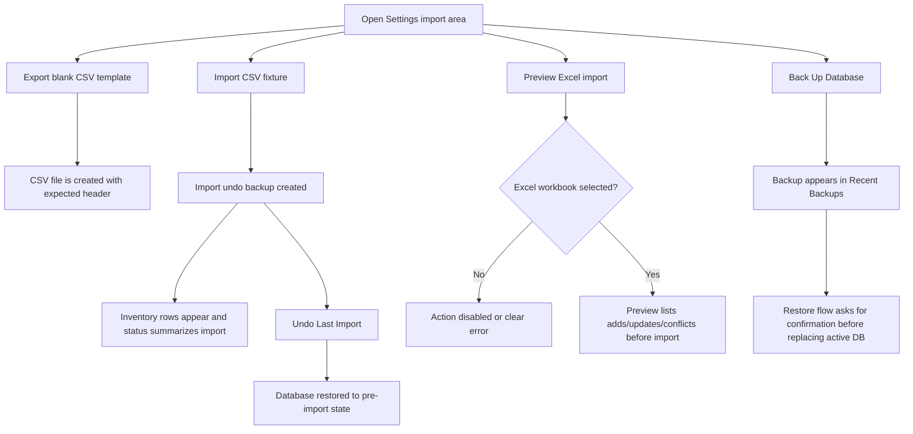
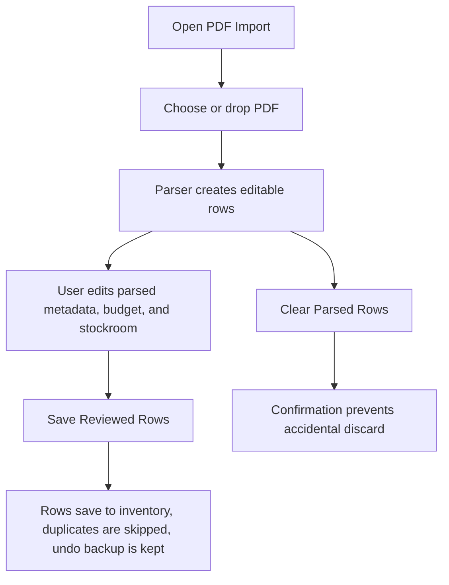
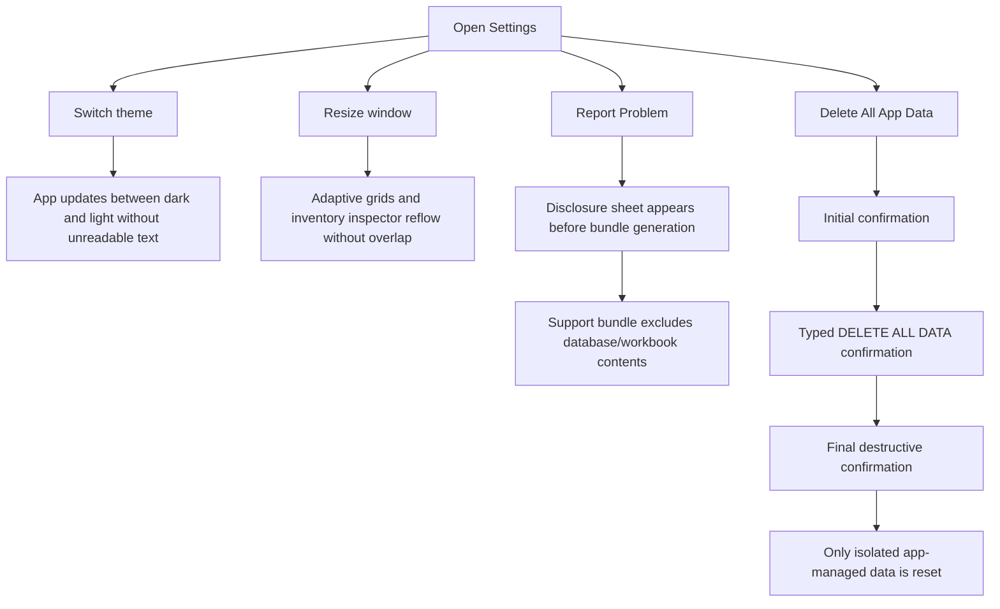

# Dogfood Report - main full app

> Full-app native macOS QA of `main`. Generated on 2026-05-27.

## Scope

This is not a branch-diff dogfood. The user explicitly asked to dogfood `main` and the full app, so every major Inventory Manager surface is in scope: first-run setup, dashboard, budgets, inventory, deployments, PDF/CSV/Excel import paths, stockrooms, settings, backups, support bundles, reset guardrails, and the local build/release-adjacent quality gate.

## App Summary

- Native macOS SwiftUI app for local hardware and asset tracking.
- Local SQLite is canonical; Excel is optional compatibility sync.
- Primary app sections: Dashboard, Budgets, Inventory, Deployments, PDF Import, Stockrooms, and Settings.
- Safety-critical flows include backups, restores, import undo, Excel rollback, support diagnostics, and multi-step reset.

## Personas

Source: inferred from `README.md`, `docs/ARCHITECTURE.md`, and the app surfaces. No `STRATEGY.md`, `VISION.md`, or persona docs were present.

- **Inventory owner / workspace admin** - needs safe setup, clear local database ownership, backups, restore, reset guardrails, and confidence that the app will not corrupt or lose inventory data.
- **IT deployment technician** - needs fast search, stockroom context, right-click actions, deployment and return flows, and obvious availability status while issuing hardware.
- **Budget / purchasing reviewer** - needs reliable budget totals, vendor spend, purchase metadata, CSV/Excel compatibility, and drilldowns from dashboard summaries to the exact underlying rows.
- **Support maintainer** - needs reproducible diagnostics, privacy-safe support bundles, build/smoke confidence, and release/update safety evidence.

## Flows Tested

### Flow 1: First-run setup and workspace readiness

### Flow 2: Demo data, dashboard drilldowns, and budgets

### Flow 3: Inventory create, edit, duplicate, deploy, and return

### Flow 4: Search, filter, context menu, and keyboard navigation

### Flow 5: Stockroom map

### Flow 6: Import, export, preview, undo, and backups

### Flow 7: PDF intake and reviewed save

### Flow 8: Diagnostics, appearance, responsive layout, and reset guardrails

## Test Matrix & Results

| # | Flow | Journey / Scenario | Status | Issue | Fix | Commit |
|---|------|--------------------|--------|-------|-----|--------|
| 1 | Build gate | Generate Xcode project and build Debug app | Pass | Debug build succeeded for `Inventory Manager.app` | - | - |
| 2 | Build gate | Run full `Scripts/ci_check.sh` smoke gate | Fixed | Security audit falsely failed on README local-database guidance naming a cloud-sync vendor | Reworded README guidance to vendor-neutral "cloud-synced folder"; full CI then passed | - |
| 3 | First run | Launch app with isolated workspace and handle install prompt/onboarding | Blocked (needs human verify) | macOS desktop was locked; app process launched, but no inspectable window was available to Computer Use | Needs unlocked desktop for visual verification | - |
| 4 | First run | Onboarding checklist reflects workspace details, database, stockroom, and spreadsheet state | Blocked (needs human verify) | Visual onboarding/checklist could not be inspected while desktop was locked | Needs unlocked desktop | - |
| 5 | Demo/dashboard | Load demo data into empty workspace and verify dashboard stats/cards/activity render | Blocked (needs human verify) | Demo data load passed in `full_app_workflow_smoke`; visual card/activity render still needs unlocked desktop | Added automated demo-load coverage | - |
| 6 | Demo/dashboard | Dashboard stat, budget, vendor, and recent activity drilldowns land on correct section/filters | Blocked (needs human verify) | Drilldowns require live UI interaction | Needs unlocked desktop | - |
| 7 | Budgets | Budget dashboard renders annual, combined, category, and configuration rows; add/save a budget year | Blocked (needs human verify) | Budget save/dashboard data passed in `full_app_workflow_smoke`; visual render/edit controls still need unlocked desktop | Added automated budget-save coverage | - |
| 8 | Inventory | Create new item; blank description is blocked, valid item saves and appears in table/inspector | Blocked (needs human verify) | Valid create/persistence passed in `full_app_workflow_smoke`; disabled-button and table/inspector render need unlocked desktop | Added automated create coverage | - |
| 9 | Inventory | Edit existing item and verify persisted fields after refresh | Pass | `full_app_workflow_smoke` edits vendor/notes and verifies persistence after reload | - | - |
| 10 | Inventory | Duplicate/right-click actions target the intended row and preserve original row | Blocked (needs human verify) | Context menu and duplicate UI require unlocked desktop | Needs unlocked desktop | - |
| 11 | Inventory | Search, header filters, chips, sorting, and reset behave coherently | Blocked (needs human verify) | Filter UI requires unlocked desktop | Needs unlocked desktop | - |
| 12 | Deployments | Deploy available item; missing recipient is blocked; valid deployment decreases availability | Blocked (needs human verify) | Valid deploy data path passed; missing-recipient disabled state needs UI verification | Added automated deploy coverage | - |
| 13 | Deployments | Mark returned preserves history and restores inventory availability | Pass | `full_app_workflow_smoke` verifies returned history and restored availability | - | - |
| 14 | Deployments | Deployment search/filter/context actions find the source inventory item and copy expected identifiers | Blocked (needs human verify) | Search/filter/context/copy actions require unlocked desktop | Needs unlocked desktop | - |
| 15 | Stockrooms | Create/edit/select stockroom and verify selected stockroom summary | Blocked (needs human verify) | Stockroom create and edit pass in automated smoke coverage; selected summary visual state needs unlocked desktop | Existing and new smoke coverage | - |
| 16 | Stockrooms | New Item Here defaults to stockroom and Open in Inventory filters correctly | Blocked (needs human verify) | Stockroom assignment passed in automated smoke; "Open in Inventory" UI filter needs unlocked desktop | Added automated stockroom assignment coverage | - |
| 17 | Stockrooms | Delete stockroom requires confirmation and unassigns items instead of deleting inventory | Blocked (needs human verify) | Database delete behavior has smoke coverage; confirmation UI needs unlocked desktop | Existing smoke coverage | - |
| 18 | CSV/Excel | Export blank CSV template and inventory CSV to expected files | Pass | `full_app_workflow_smoke` verifies both export files and expected CSV contents | - | - |
| 19 | CSV/Excel | Import CSV fixture, create undo backup, and undo last import | Pass | `full_app_workflow_smoke` imports CSV, verifies undo backup, and restores pre-import count | - | - |
| 20 | CSV/Excel | Excel helper read/append/update/delete/remaining sync smoke checks pass | Pass | `SmokeTests/import_fixture_smoke.py` passed | - | - |
| 21 | PDF import | PDF empty state, choose/drop affordance, parsed row editor, save, duplicate skip, and clear confirmation | Blocked (needs human verify) | PDF fallback parse and save passed in `full_app_workflow_smoke`; empty/drop/editor/clear UI needs unlocked desktop | Added automated PDF save coverage | - |
| 22 | Backups | Manual backup appears in Recent Backups; restore/prune confirmations protect destructive actions | Blocked (needs human verify) | Manual backup creation and records passed; restore/prune dialogs need unlocked desktop | Added automated backup coverage | - |
| 23 | Settings | Appearance, workspace branding, database path, users, maintenance, and status messages render cleanly | Blocked (needs human verify) | Settings render/theme/status are visual and need unlocked desktop | Needs unlocked desktop | - |
| 24 | Support | Report Problem disclosure appears and generated bundle contains diagnostics/logs, not database/workbook contents | Blocked (needs human verify) | Support bundle privacy passed directly; disclosure UI needs unlocked desktop | Added automated support bundle coverage | - |
| 25 | Reset | Delete All App Data requires all confirmations and only resets isolated app-managed data | Blocked (needs human verify) | Destructive reset UI requires unlocked desktop and should be run only against isolated app data | Needs unlocked desktop | - |
| 26 | Responsiveness | 1440x900 and compact-width layouts reflow without overlap or clipped primary controls | Blocked (needs human verify) | Visual layout inspection blocked by locked desktop | Needs unlocked desktop | - |
| 27 | Keyboard/accessibility | Sidebar/menu keyboard shortcuts, tab order, labels, and context menu access are usable | Blocked (needs human verify) | Keyboard/accessibility inspection blocked by locked desktop | Needs unlocked desktop | - |
| 28 | Runtime health | No crash reports, unexpected app errors, or relevant unified-log errors during dogfood | Blocked (needs human verify) | Build and smoke logs are clean; locked-desktop launch produced system AppIntents/linkd registration noise and no inspectable window | Recheck in unlocked desktop session | - |

## What Was Fixed

### README cloud-sync wording tripped the security audit

- **Symptom:** `Scripts/ci_check.sh` failed in `Scripts/security_audit.sh` before build because `README.md` named a cloud-sync vendor in local SQLite database guidance.
- **Root cause:** The repo security audit intentionally rejects sensitive or organization-adjacent terms in public source. The README warning was correct product guidance, but the specific vendor naming made the gate fail.
- **Fix:** Reworded the README local-first warning to say "cloud-synced folder" instead of naming a specific sync product.
- **Regression test:** `Scripts/security_audit.sh` and the full `Scripts/ci_check.sh` both pass after the wording change.

### Full-app coordinator smoke coverage added

- **Symptom:** The locked macOS desktop blocked live visual dogfood, leaving too much of the full-app workflow dependent on manual UI access.
- **Root cause:** This repo had strong data/workbook smoke checks but no single high-level coordinator smoke covering the app flows a user drives from the UI.
- **Fix:** Added `SmokeTests/full_app_workflow_smoke.swift` and `SmokeTests/run_full_app_workflow_smoke.sh`, then wired it into `Scripts/ci_check.sh`.
- **Regression test:** The new smoke covers stockroom creation, inventory create/edit, deployment/return, budget save, CSV export/template/import/undo, PDF fallback parse/save, manual backup records, demo workspace load, and privacy-safe support bundle contents.

## Paper Cuts By Persona

No product paper cuts could be judged from the live UI because the desktop was locked. The automated coordinator smoke did not expose data-flow friction, but visual copy, layout density, focus order, and context-menu ergonomics still need an unlocked pass.

## Runtime Errors

Build and smoke gate clean after the README wording fix:

- `Scripts/security_audit.sh` passed.
- `xcodegen generate` created `InventoryManager.xcodeproj`.
- `xcodebuild -project InventoryManager.xcodeproj -scheme InventoryManager -configuration Debug -destination 'platform=macOS' build` succeeded.
- `SmokeTests/run_fresh_workspace_smoke.sh` passed.
- `SmokeTests/run_workflow_smoke.sh` passed.
- `SmokeTests/run_app_model_safety_smoke.sh` passed.
- `SmokeTests/run_full_app_workflow_smoke.sh` passed.
- `SmokeTests/run_migration_smoke.sh` passed.
- `SmokeTests/import_fixture_smoke.py` passed.

Live app launch note:

- The app process launched from the Debug bundle.
- The macOS desktop was locked during launch; `Computer Use` reported `cgWindowNotFound`, and screenshots showed the lock screen.
- Unified logs contained AppIntents/linkd registration noise during the locked launch. No app crash was observed, but this needs an unlocked relaunch before being treated as a product issue or dismissed as environment noise.

## Human Verifications

The app has no OAuth, payments, SMS, or real email delivery legs. The remaining human verification is local: unlock the desktop and rerun the visual UI matrix rows.

## Decisions for a Human

None on product direction. The only unresolved item is environmental: the visual UI dogfood cannot complete while the macOS desktop is locked.

## Learnings

- The security audit is intentionally conservative; public docs should avoid naming local organization/vendor context when a generic phrase carries the same product guidance.
- The repo now has a higher-level app coordinator smoke that better matches the way users exercise Inventory Manager through the UI.
- Visual dogfood of native macOS apps depends on an unlocked desktop session; when locked, use automated coordinator tests to keep coverage moving, but do not claim visual/layout readiness.

## Final Status

Automated build and workflow coverage is green after one README fix and one added smoke test. Full visual UI dogfood is blocked until the desktop is unlocked, so `main` is not fully dogfooded from a user-experience standpoint yet. The remaining work is to rerun the blocked visual rows in an unlocked desktop session.
