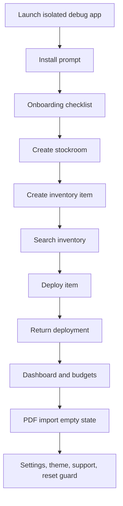

# Dogfood Report - main full app

> Full-app native macOS dogfood of `main`. Generated on 2026-05-27.

## Scope

This was a full app pass, not a branch-diff dogfood. The covered surfaces were first-run setup, onboarding, dashboard, budgets, inventory, deployments, PDF intake, stockrooms, settings, CSV/Excel/PDF data paths, backups, support bundles, reset guardrails, and the local build/smoke gate.

## Environment

- Branch: `codex/full-app-dogfood-main`
- Base: `main` at `16c1c9b`
- App: `/Users/dalvisdev/Library/Developer/Xcode/DerivedData/InventoryManager-ewpumlxqwuesfwfukinfireyemud/Build/Products/Debug/Inventory Manager.app`
- Bundle id: `com.inventorymanager.app`
- Version/build: `0.1.4` / `5`
- Isolated visual dogfood database: `/tmp/inventory-manager-visual-dogfood/InventoryData.sqlite`

## Product Model

- Native macOS SwiftUI app for local hardware and asset tracking.
- Local SQLite is canonical; Excel remains an optional compatibility workflow.
- Primary app sections: Dashboard, Budgets, Inventory, Deployments, PDF Import, Stockrooms, and Settings.
- Safety-critical flows include backups, restores, import undo, support diagnostics, and multi-step reset.

## Personas

Source: inferred from `README.md`, `docs/ARCHITECTURE.md`, and the app surfaces.

- **Inventory owner / workspace admin** - needs safe setup, clear database ownership, backups, restore, and reset guardrails.
- **IT deployment technician** - needs fast search, stockroom context, deployment and return flows, and obvious availability state.
- **Budget / purchasing reviewer** - needs budget totals, vendor spend, purchase metadata, CSV/Excel compatibility, and drilldowns to source rows.
- **Support maintainer** - needs reproducible diagnostics, privacy-safe support bundles, and green build/smoke evidence.

## Journeys Exercised

## Test Matrix

| # | Area | Scenario | Status | Evidence / Fix |
|---|------|----------|--------|----------------|
| 1 | Build gate | Generate project and build Debug app | Pass | `xcodebuild` succeeded for `Inventory Manager.app`. |
| 2 | Build gate | Run full repository smoke gate | Pass | `Scripts/ci_check.sh` passed after fixes. |
| 3 | Security docs | Security audit rejected README cloud-sync vendor wording | Fixed | Reworded to generic "cloud-synced folder"; `Scripts/security_audit.sh` passes. |
| 4 | First run | Install prompt from debug bundle | Pass | Prompt appeared; `Continue Here` opened the app without moving the dogfood build. |
| 5 | Onboarding | Checklist reflects workspace/database/stockroom/spreadsheet state | Pass | Checklist updated after stockroom creation and showed spreadsheet workflow as optional/unselected. |
| 6 | Stockrooms | Create first stockroom with blank-name guard | Pass | Create button stayed disabled until name was entered; stockroom card appeared after save. |
| 7 | Inventory | New item from stockroom defaults to selected stockroom | Pass | Created `Visual Dogfood Laptop`; stockroom summary and inventory row both reflected assignment. |
| 8 | Inventory | Search narrows inventory table | Pass | `VD-001` search showed exactly one row and retained the inspector. |
| 9 | Inventory | Edit/persistence paths | Pass | `full_app_workflow_smoke` edits fields and verifies after reload. |
| 10 | Deployments | Missing recipient disables deploy; valid deploy decreases availability | Pass | Deploy sheet disabled action until recipient; valid deploy reduced available quantity from 2 to 1. |
| 11 | Deployments | Return keeps history and restores availability | Fixed | UI confirmation worked; inventory availability returned to 2. Returned rows now show inert `Returned` text instead of a live-looking `Mark Returned` action. |
| 12 | Dashboard | Dashboard cards, budget status, vendor spend, recent activity | Pass | Rendered with seeded live data after deploy/return activity. |
| 13 | Budgets | Annual, combined, category, and configuration sections render | Fixed | Category heading now renders `2026 CAPEX SPENDING` instead of localized `2,026 CAPEX SPENDING`. |
| 14 | PDF Import | Empty choose/drop affordance | Pass | PDF intake screen rendered clear choose/drop copy; parser/save path is covered by smoke. |
| 15 | CSV/Excel | CSV template/export/import/undo and Excel helper smoke | Pass | `full_app_workflow_smoke` and `SmokeTests/import_fixture_smoke.py` passed. |
| 16 | Backups | Manual backup and backup filtering | Pass | `full_app_workflow_smoke` verifies backup record creation and safe filtering. |
| 17 | Settings | Branding, database path, users, maintenance, and status sections | Pass | Settings rendered live isolated database path, admin user, and maintenance controls. |
| 18 | Appearance | Dark and light theme toggle | Pass | Toggled light and back to dark; primary settings text and controls remained readable. |
| 19 | Support | Report Problem disclosure | Pass | Menu item opened disclosure showing included/not-included data; bundle privacy is covered by smoke. |
| 20 | Reset | Delete All App Data guardrails | Pass | First confirmation and exact `DELETE ALL DATA` typed gate verified; final destructive action was not executed. |
| 21 | Stockroom layout | Default-width stockroom detail card | Fixed | Removed clipped action labels by narrowing the selector panel, wrapping action buttons, and making edit/delete icon-only with help text. |
| 22 | Runtime health | Crash/errors during dogfood | Pass | No app crash observed; build and smoke logs are clean. |

## Fixes Made

### README wording for security audit

- **Symptom:** `Scripts/security_audit.sh` failed because README local-database guidance named a cloud-sync vendor.
- **Fix:** Changed the warning to say "cloud-synced folder" instead.
- **Verification:** `Scripts/security_audit.sh` and `Scripts/ci_check.sh` pass.

### Full-app coordinator smoke

- **Symptom:** The existing smoke checks did not cover the full app workflow in one place.
- **Fix:** Added `SmokeTests/full_app_workflow_smoke.swift`, `SmokeTests/run_full_app_workflow_smoke.sh`, and wired it into `Scripts/ci_check.sh`.
- **Coverage:** Stockrooms, inventory create/edit, deploy/return, budget save, CSV export/template/import/undo, PDF fallback parse/save, manual backup records, demo workspace load, and privacy-safe support bundle contents.

### Returned deployment action

- **Symptom:** After returning a deployment, the Actions column still showed a live-looking `Mark Returned` control.
- **Fix:** Returned deployments now show muted `Returned` text plus the delete action.
- **Verification:** Rebuilt app and visually checked the returned row after horizontal scroll.

### Budget category year formatting

- **Symptom:** SwiftUI localized the budget category year as `2,026 CAPEX SPENDING`.
- **Fix:** Rendered the category heading with `Text(verbatim:)`.
- **Verification:** Rebuilt app and visually confirmed `2026 CAPEX SPENDING`.

### Stockroom compact layout

- **Symptom:** At the default window width, stockroom detail controls clipped labels (`Open in...`, `New Item H...`, and truncated edit/delete button text).
- **Fix:** Reduced the stockroom selector column width, made the detail action buttons adapt between horizontal and vertical layouts, and converted header edit/delete controls to icon-only buttons with help text.
- **Verification:** Rebuilt app and visually checked the default-width stockroom detail card.

## Remaining Risk

- I did not execute the final destructive reset button because the app correctly warned that it would delete the app-managed Application Support directory; the typed confirmation gate was verified and cancelled.
- I did not do an exhaustive keyboard tab-order audit. Menu routes and accessibility labels were spot-checked through macOS accessibility.

## Final Status

Full-app dogfood is complete for the main app flows. Build, security audit, automated workflow smoke coverage, and the unlocked native UI pass are green after the fixes above.
